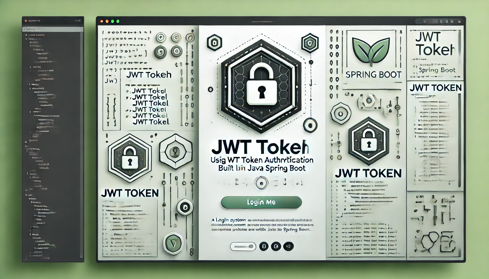

# Login system




> Login system using Java Spring Boot and Auth2.0 with JWT Token technology.

## 💻 Pré-requisitos

Antes de começar, verifique se você atendeu aos seguintes requisitos:

- Você instalou a versão mais recente de:
  - `Java: Versão 17 ou superior`
  - `Maven: Instalado e configurado corretamente`
  - `Spring Boot 3.1.2: Framework principal`
  - `Spring Data JPA: Acesso e manipulação do banco de dados`
  - `Spring Security: Implementação de autenticação e autorização`
  - `MySQL Connector: Integração com banco de dados MySQL`
  - `Java JWT: Manipulação de tokens JWT`
  - `Jakarta Validation: Validação de dados com anotações`
  


- Você tem uma máquina: `<Windows / Linux / Mac>`. 


## 🚀 Como Configurar o Projeto

Para instalar o Login System, siga estas etapas:

Windows, Linux e macOS:
1. Clone o repositório
```
git clone <url-do-repositorio>
cd loginapi
```

2. Crie um arquivo .env com as propriedades do seu ambiente
```
//JWT info
JWT_SECRET=YOUR_SECRET_KEY_HERE
JWT_ISSUER=YOUR_ISSUER_HERE

//Database info
DB_URL=YOUR_DB_URL_HERE
DB_USER=YOUR_DB_USER_HERE
DB_PWD=YOUR_DB_PASSWORD_HERE
```
3. Na primeira execução, configure o Spring para criar e popular a base de dados. No arquivo application.properties, adicione:
```
spring.jpa.hibernate.ddl-auto=create
```
4. Use a IDE de sua preferência para rodar o código:
   Para este projeto, foi utilizada a [IntelliJ IDEA Community Edition](https://www.jetbrains.com/idea/download/). Se preferir, também pode rodar diretamente pelo terminal:
```
mvn spring-boot:run
```
